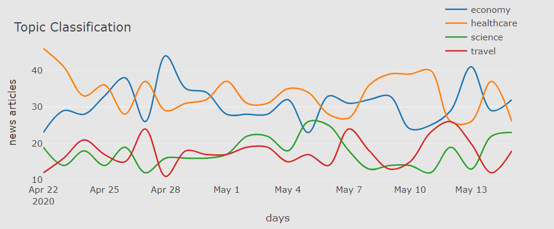
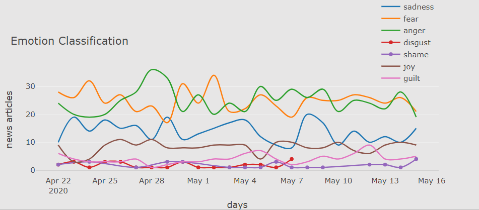

# Corona
"Analyzing Dutch News related to Corona"

By the beginnig of Covid-19 infection cases in Netherlands, we came up with the idea of Analyzing Dutch News in this regard.
To do so, we had four different approaches:

1- Polarity identification : to determine the news with Negative or Positive labels  

2- Topic Classification : to classify Dutch news in four categories of Healthcare, Economic, Travel and Science  

  

3- Emotion Recognition : to extract which emotions can be recognized from the news  

  

4- Fact checking : to recognize whether the news are reliable or not

Notes: Codes of each approach and the results are in related folders  
Python libraries: **Pandas, Numpy, Sklearn, BS4, NLTK**  

To accomplish all of mentioned approaches, we scraped news from different sources such as google news of USA and Netherlands, 
RIVM, WHO, Dutch government and Poynter (an international platform including collection of False and misleading news).
Our collected data are also inserted in corresponding folders.

To look at our presentation in Prezi please refer to : https://prezi.com/view/0tAG4DxwT8aQCkYD3Rb7/
